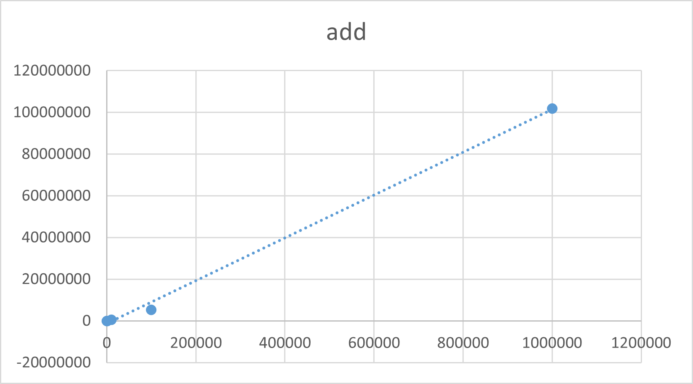
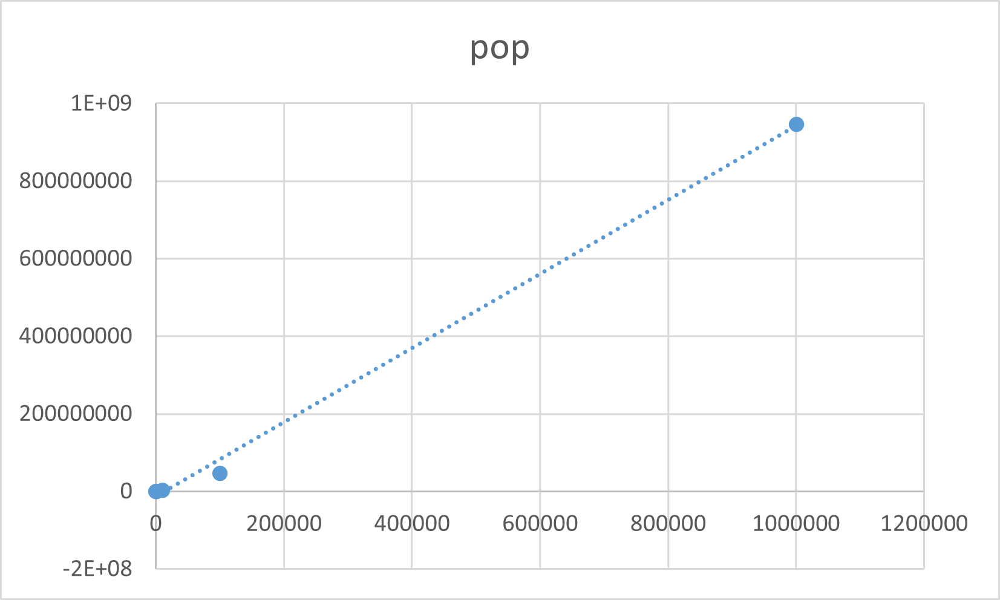

# Heap exercise from lab class

The questions are

1. Using the given heap.java and PriorityQ.java to test three scenarios that are add() and pop() 100, 10000
   and 1,000,000 randomly generated integers. Plot the time used in each scenario.
2. Modify the MaxIntHeap class to reverse the order of the original heap.java file

---

### 1. Using the [TimeComplexity.java](TimeComplexity.java) file, we can get this result

- Add - O(n)
  

- Pop - O(n)
  
